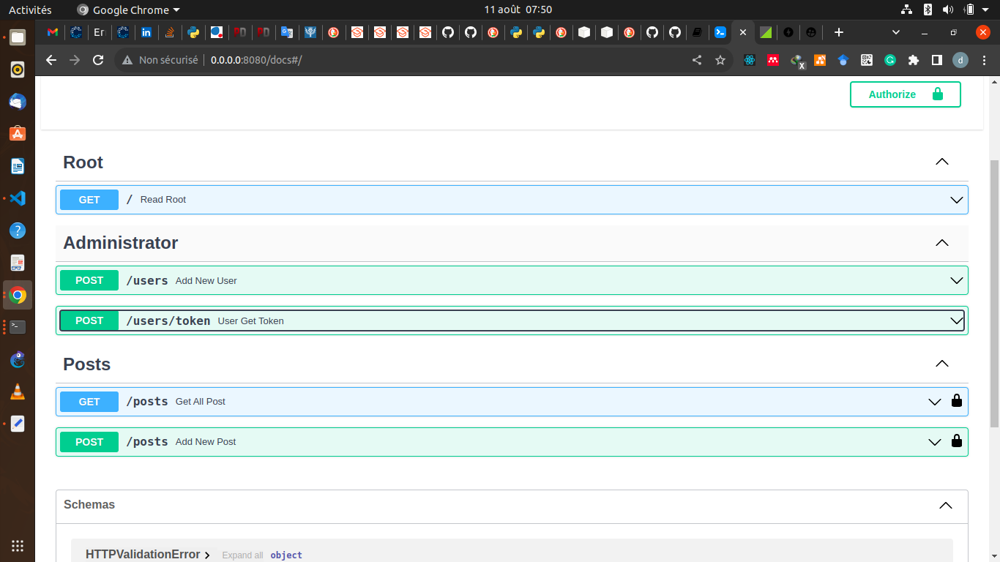
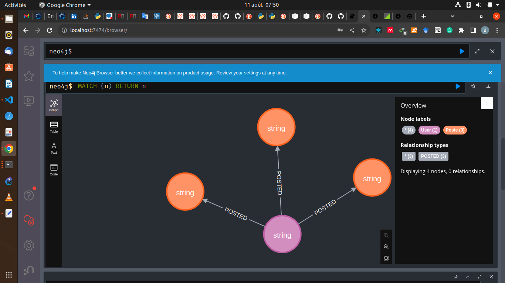

# FastAPI and NEO4J Boilerplate
A simple starter for building RESTful APIs with FastAPI and NEO4J.


# Features
  - Python FastAPI backend.
  - Neo4J database.
  - Authentication
  - Deployment

# Using the applicaiton
To use the application, follow the outlined steps:
  1. Clone this repository and create a virtual environment in it:
     ```
         $ python3 -m venv venv
     ```
  2.Install the modules listed in the `requirements.txt` file: 


  3. You also need to start your NEO4J instance either locally or on Docker as well as create a `.env.dev` file. See the `.env.sample` for configurations. 

    Example for running locally NEO4J at port 7474:
    ```console
    cp .env.sample .env.dev
    ```

  4. Start the application:

      ```console
      python main.py
      ```


The starter listens on port 8000 on address [0.0.0.0](0.0.0.0:8080). 




The Neo4j Database example




